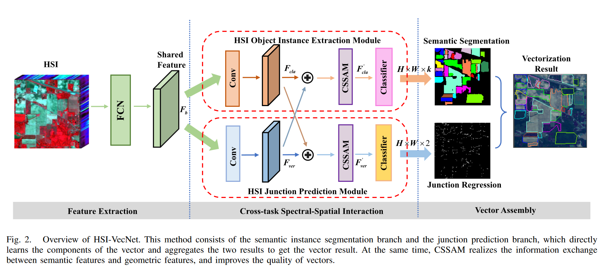

# HSI-VecNet
This is Pytorch implementation for "Toward the Vectorization of the Hyperspectral Imagery"

## Overview
The overall framework for HSI-VecNet.

## Running the code
1. Run train.py to train a new model.

- Please put the  hyperspectral vectorization datasets into datasets folder.
- The datasets folder is constructed as follows:
  -- indian_pines
  ---- indian_pines.mat
  ---- indian_pines_gt.mat
  ---- indian_pines_coco.json

2. Run inference.py to inference the vectorization results.

3. Run evaluation.py to evaluate the vectorization performance.

- The datasets can be downloaded from: 
 https://pan.baidu.com/s/19CSagulDBTs9nwcHvMahIw
Password: ikls

## BibTeX
```
@article{fang2023towards,
  title={Towards the vectorization of hyperspectral imagery},
  author={Fang, Leyuan and Yan, Yinglong and Yue, Jun and Deng, Yue},
  journal={IEEE Transactions on Geoscience and Remote Sensing},
  year={2023},
  publisher={IEEE}
}
```
